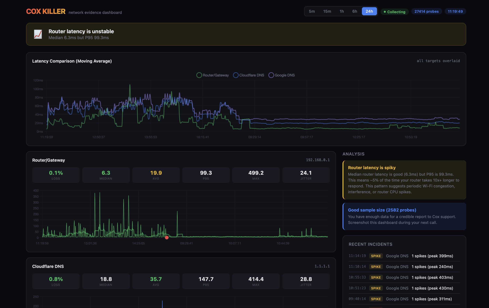
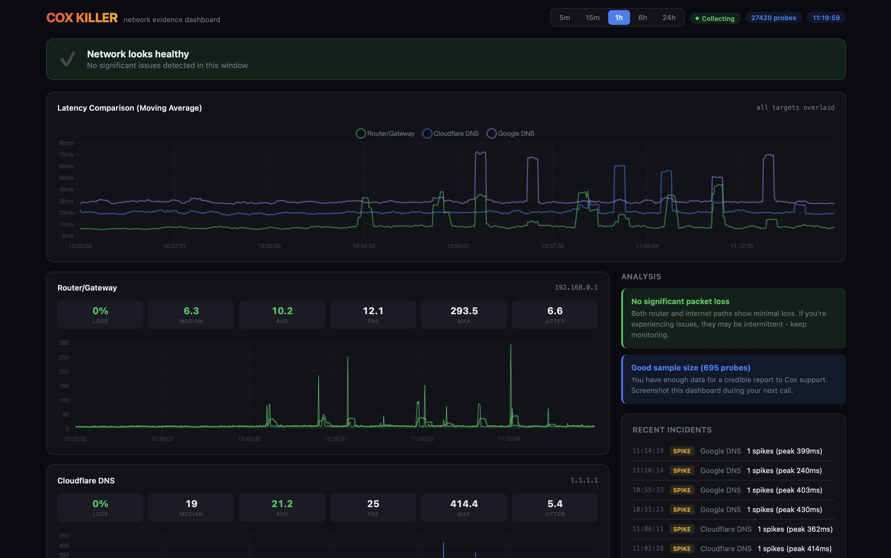

# Cox Killer

**Network evidence dashboard that continuously monitors your connection and proves whether your ISP or your router is the problem.**

Cox Killer runs a ping-based probe against your router gateway and two public DNS servers (Cloudflare 1.1.1.1, Google 8.8.8.8). If the gateway is clean but external targets show loss, the problem is your ISP. If the gateway itself drops packets, it's your local network. The dashboard visualizes this in real time and generates an escalation toolkit with call scripts, counter-arguments, and evidence you can present to support.

Named for Cox, but works against any ISP.

   



<details>
<summary>Healthy network view (1h window)</summary>


</details>

## Features

**Works with any ISP:**
- **Real-time latency and packet loss charts** for router, Cloudflare, and Google DNS
- **Automated verdict** — immediately tells you who's at fault with supporting evidence
- **Incident log** — tracks every drop and latency spike with timestamps
- **Settings pane** — secure password storage, live router stats, CSV/JSON data export
- **Report generation** — text reports with diagnosis, suitable for attaching to support tickets

**ISP call script (built for Cox, works for any ISP):**
- **Opening statement** auto-populated with your live monitoring data
- **Counter-arguments** for every deflection tactic support agents use
- **Magic phrases** — technical terminology that signals you know your stuff
- **Escalation ladder** — from Tier 1 through FCC complaint with instructions at each step

**TP-Link BE10000 bonus features (optional):**
- **Router integration** — reads/writes settings via encrypted LuCI API
- **Auto-optimization** — applies recommended settings (disable Smart Connect, QoS, Flow Controller, etc.)
- **Router diagnostics** — data-driven recommendations based on your specific latency patterns

**macOS bonus features (optional):**
- **Native macOS app** — Swift wrapper that manages the daemon and dashboard
- **Interactive terminal dashboard** — CLI with sparkline graphs (no browser needed)
- **MTR traceroute** — hop-by-hop analysis

## Requirements

- **Python 3.6+** (stdlib only, no pip packages)
- macOS, Linux, or Windows

Optional:
- **Node.js** 18+ for TP-Link router integration (stdlib only, no npm packages)
- **Bash** 4+ for the interactive terminal dashboard (`netprobe` script, macOS/Linux)
- `mtr` for traceroute analysis (`brew install mtr` / `apt install mtr`)

## Quick Start

### macOS / Linux

```bash
git clone https://github.com/mejohnc-ft/CoxKiller.git
cd CoxKiller

# Start monitoring + web dashboard
python3 netprobe.py --web
```

### Windows

```powershell
git clone https://github.com/mejohnc-ft/CoxKiller.git
cd CoxKiller

# Start monitoring + web dashboard
python netprobe.py --web
```

This starts the background probe daemon and opens the dashboard at `http://localhost:8457`.

### Other commands

```bash
# Daemon only (background, continuous logging)
python3 netprobe.py --daemon

# Stop daemon
python3 netprobe.py --stop

# Generate report from latest log
python3 netprobe.py --report

# Interactive terminal dashboard (macOS/Linux only, uses bash netprobe)
./netprobe
./netprobe --duration 30    # run for 30 minutes
./netprobe --mtr            # MTR traceroute (requires sudo + mtr)
```

## Router Integration (TP-Link BE10000 / Archer BE800)

> **Optional** — the dashboard works fine without router integration. This is a bonus for TP-Link BE10000 / Archer BE800 owners.

The router tools communicate with TP-Link routers via their encrypted LuCI API (AES-128-CBC + RSA). Requires Node.js.

```bash
# Read current settings and get optimization recommendations
node router_login.mjs <router-password> read

# Auto-apply all recommended optimizations
node router_login.mjs <router-password> apply

# Get router status (WAN IP, uptime, wireless bands, device info)
node router_login.mjs <router-password> status

# Read/write specific settings
node router_login.mjs <router-password> get wireless_5g
node router_login.mjs <router-password> set wireless_5g htmode=80
```

You can also store your router password via the dashboard's Settings pane (gear icon), which enables one-click router status checks from the GUI. On macOS, passwords are stored in Keychain. On other platforms, they're stored in an obfuscated local file.

## How It Works

```
netprobe.py (python)        server.py (python)         browser
   |                             |                        |
   |-- ping gateway -----------> |                        |
   |-- ping 1.1.1.1 ----------> |                        |
   |-- ping 8.8.8.8 ----------> |                        |
   |                             |                        |
   +-> logs/*.csv -------------> reads CSV, computes      |
                                 stats, analysis,   ----> real-time charts,
                                 remediation              verdict, call scripts
```

- **`netprobe.py`** — cross-platform Python daemon that pings 3 targets every 5 seconds, logs to CSV
- **`netprobe`** — bash version with interactive terminal UI (macOS/Linux)
- **`server.py`** — Python HTTP server on port 8457, single-page dashboard with analysis engine
- **`router_login.mjs`** — Node.js client for TP-Link encrypted router API (optional)
- **`router_ctl.py`** — alternative Python implementation of the router API (optional)
- **`CoxKiller.swift`** — native macOS app wrapper (optional)

## Project Structure

```
CoxKiller/
  netprobe.py         # Cross-platform probe daemon (python)
  netprobe            # Interactive terminal probe (bash, macOS/Linux)
  server.py           # Web dashboard + API server (python)
  router_login.mjs    # TP-Link router API client (node, optional)
  router_ctl.py       # Router API client alt (python, optional)
  CoxKiller.swift     # Native macOS app wrapper (optional)
  make_icon.py        # App icon generator
  cox_killer_icon.png # Favicon / app icon
  package.json        # npm scripts for convenience
  logs/               # CSV data, reports, PID files (gitignored)
```

## Platform Support

| Feature | macOS | Linux | Windows |
|---------|-------|-------|---------|
| Network monitoring (netprobe.py) | Yes | Yes | Yes |
| Web dashboard (server.py) | Yes | Yes | Yes |
| Password storage | Keychain | File | File |
| Router integration (Node.js) | Yes | Yes | Yes |
| Interactive terminal (bash) | Yes | Yes | No |
| Native app (Swift) | Yes | No | No |
| MTR traceroute | Yes | Yes | No |

## License

MIT
